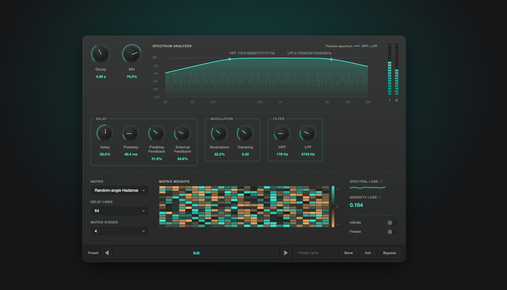

# ultra-fdn-ui

リバーブプラグインの「イケてるUI」だけを実装し、実装者が自由に組み込んで使えるようにすることを目的としたリポジトリです。



## 目的

- 音声処理のロジックは持たず、**UIコンポーネント一式**を提供する
- [`Design.md`](./Design.md) にデザイントークン（色・タイポグラフィ・間隔・エフェクトなど）とコンポーネント仕様を定義し、実装の指針とする
- Storybook 上で各コンポーネントを単体表示・確認できるようにし、他プロジェクトへの流用や差し替えをしやすくする

## このリポジトリが提供するもの

- `Design.md`: デザイントークンおよびコンポーネント仕様書
- Storybook: 各UIコンポーネントのカタログ（`pnpm storybook`）
- UIコンポーネント実装（`src/components/`。音声処理ロジックは含まない）

## セットアップ

```bash
pnpm install
```

## 開発

```bash
pnpm dev         # 全コンポーネントを組み合わせたデモアプリを起動
pnpm storybook   # コンポーネントカタログを起動
```
